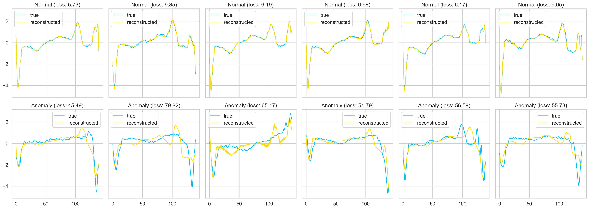
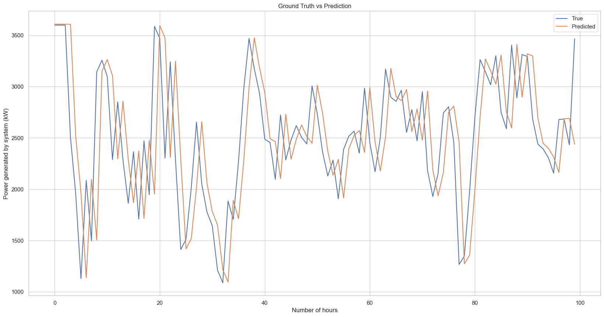

<p align="center"></p>
<h1 align="center">ChronomancerAI: A TimeSeries analysis and model training repository</h1>
<hr>

<p align="center">
  <a href="https://skillicons.dev">
    
  </a>
</p>
<hr>

ChronomancerAI is a repository dedicated to time series data analysis and model training. It contains two main projects: ECG anomaly detection and wind energy production prediction. Each project is implemented using LSTMs and other deep learning models to analyze and predict patterns within the respective datasets.

## Repository Structure

The repository is organized as follows:

```
ChronomancerAI
├── anomaly_detection_ecg
│   ├── ECG5000
│   ├── lstm_anomaly_detection_ecg.ipynb
├── model.pth
├── pretrained_model.pth
├── docs
│   └── img
│       ├── anomaly_detection_examples.png
│       └── prediction_examples.png
├── prediction_wind_energy
│   ├── dataset
│   │   └── T1.csv
│   ├── lstm_wind_energy_prediction.ipynb
├── venv
├── .gitignore
├── LICENSE
├── README.md
├── requirements.txt
```

- `anomaly_detection_ecg`: Contains the notebook and dataset for ECG anomaly detection.

  - `ECG5000`: Dataset of ECG signals for training and evaluating the anomaly detection model.
  - `lstm_anomaly_detection_ecg.ipynb`: Notebook for building, training, and evaluating the LSTM model for detecting anomalies in ECG data.

- `prediction_wind_energy`: Contains the notebook and dataset for wind energy production prediction.

  - `T1.csv`: Dataset for wind energy generation data used to train the model.
  - `lstm_wind_energy_prediction.ipynb`: Notebook for building, training, and evaluating the LSTM model for predicting wind energy production.

- `docs/img`: Images that show the results of both projects.

  - `anomaly_detection_examples.png`: Contains plots of reconstructed signals with their respective losses for both normal and anomalous ECGs.
  - `prediction_examples.png`: Shows a comparison of true vs. predicted wind energy production over time.

- `pretrained_model.pth`: Pre-trained anomaly detection model used within the notebooks.

- `requirements.txt`: Python package dependencies.

## Description of Notebooks

### Anomaly Detection for ECG using LSTM

This notebook is used to train and evaluate an LSTM-based autoencoder model to detect anomalies in ECG signals. The dataset used is ECG5000, which contains multiple examples of normal and abnormal heartbeats. The model is trained to reconstruct normal signals, and the reconstruction loss is used as an indicator of anomalies.

#### Key Steps:

- Data preprocessing: Load and normalize the ECG data.
- Model building: Create an LSTM-based autoencoder model.
- Training: Train the model using normal ECG samples.
- Evaluation: Compute reconstruction losses and use them to identify anomalies.

#### Results



- The plots display the reconstructed ECG signals for both normal and anomalous cases. Each plot has two lines: `true` (the original signal) and `reconstructed` (the reconstructed signal from the model).
- The `loss` value in each title represents the reconstruction error. A higher loss usually indicates an anomaly.

### Wind Power Prediction using LSTM AutoEncoder

This notebook is designed to predict wind energy production using LSTMs. The dataset used (`T1.csv`) contains wind energy production values over time, and the LSTM model learns to predict future energy output based on historical data.

#### Key Steps:

- Data preprocessing: Load the wind energy dataset and normalize the values.
- Model building: Create an LSTM-based model to predict future energy production.
- Training: Train the model on historical energy data.
- Evaluation: Compare the model's predictions with the actual energy values.

#### Results



- The plot shows the ground truth (`True`) versus the predicted (`Predicted`) wind energy production over a period of time. The model demonstrates good predictive capability, capturing the general trend of the true data.

## Installation

To install the necessary dependencies, run the following command:

```sh
pip install -r requirements.txt
```

## Usage

Each notebook can be run independently for its respective task. Make sure to extract the datasets and place them in the appropriate directories.

## License

This repository is licensed under the MIT License. See the [Licence](LICENSE) file for more details.

